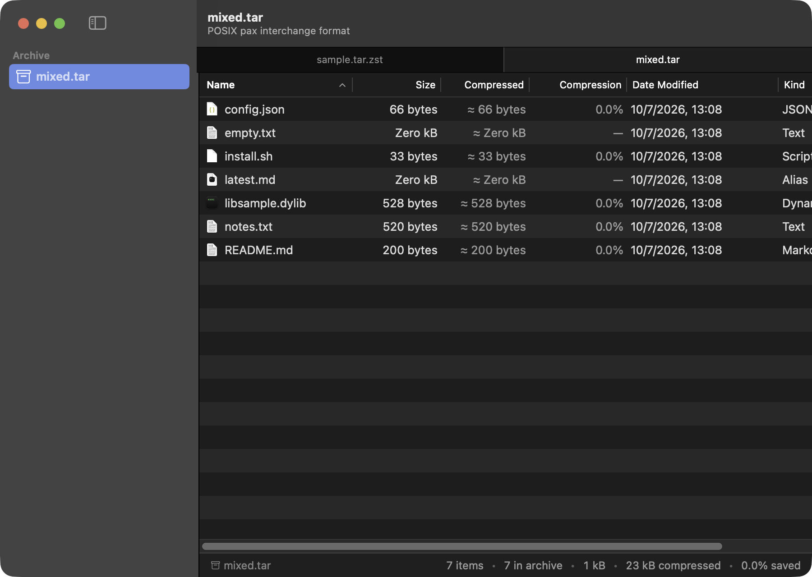

# ArchiveCat 🐱📦

A native macOS archive browser.

ArchiveCat opens an archive and lets you look inside it **like a folder** —
without extracting it. Think Finder × BetterZip × Quick Look, built with
AppKit and SwiftUI, backed by libarchive.

It is deliberately not a compression utility. Version 1 is read-only:
it browses, previews, searches and selectively extracts. It never modifies an
archive, and it never unpacks one unless you ask it to.



---

## What it does

* **Opens an archive and scans it in the background.** Format detection is
  libarchive's job, not the file extension's: ZIP, TAR, TAR.GZ/BZ2/XZ/ZST, 7z,
  RAR (as far as the linked libarchive supports it), CPIO, XAR, ISO and more.
* **Builds a virtual directory tree.** Archives store flat paths; ArchiveCat
  turns them into a hierarchy, synthesizing the folders an archive forgot to
  record (the usual case for `tar cf x.tar usr/bin/tool`).
* **Browses like Finder.** A native source list for the tree, a real
  `NSTableView` for the file list with sortable columns, breadcrumb navigation,
  back/forward history, and an inspector pane.
* **Previews with Space.** Only the selected entry is extracted, into a
  keyed cache under `~/Library/Caches/com.frankruan.ArchiveCat/Preview/`, and
  handed to the system Quick Look panel.
* **Drags files into the Finder.** Drag one or many entries out and the Finder
  receives real files. Nothing is extracted at drag time — the payload is
  produced on drop, via `NSFilePromiseProvider`.
* **Extracts selectively.** One file, a selection, a folder subtree, or the
  whole archive — with a destination picker, a real question when files already
  exist (Replace / Skip / Keep Both / Cancel), live progress and cancellation.
* **Searches names and paths** against the in-memory index, as you type.
* **Inspects metadata.** Sizes, compression ratio, POSIX permissions, UID/GID,
  link counts, symlink targets, device numbers, and an on-demand content check
  that identifies Mach-O binaries (including their architectures), ELF objects,
  static libraries, plists, JSON, scripts and text.

## What it never does

* It never modifies an archive: no renaming, deleting, adding or creating.
  Those are v1 non-goals, and the engine has no write path at all.
* It never extracts the whole archive as a side effect of browsing, previewing,
  searching or dragging.
* It never overwrites a file silently.
* It never lets an archive write outside the folder you chose.

---

## Requirements

* macOS 14 or later (Apple Silicon first; the code is architecture-neutral)
* Xcode 16 or later (this checkout was built with Xcode 27 / Swift 6.4)
* [libarchive](https://libarchive.org) from Homebrew:

```sh
brew install libarchive
```

ArchiveCat uses the libarchive **dylib** rather than a vendored copy, so the
headers and the library always agree. `Package.swift` finds it automatically in
`/opt/homebrew/opt/libarchive` (Apple Silicon) or `/usr/local/opt/libarchive`
(Intel); set `LIBARCHIVE_PREFIX` to point somewhere else.

## Build and run

```sh
make test     # engine test suite (84 tests)
make build    # build everything, debug
make app      # assemble dist/ArchiveCat.app (release, signed, self-contained)
make run      # build and launch it
```

`make app` bundles libarchive and its Homebrew dependencies into
`ArchiveCat.app/Contents/Frameworks` and rewrites their install names, so the
resulting app does not depend on Homebrew being installed on the machine that
runs it. It is signed ad-hoc with the sandbox entitlements from
`Resources/ArchiveCat.entitlements`; set `CODESIGN_IDENTITY` to sign with a real
identity.

All SwiftPM invocations go through `Scripts/swift.sh`, which pins every cache
(SwiftPM, Clang modules, `TMPDIR`) inside `.build/`. That keeps builds working
in sandboxes and CI, and keeps them from scattering files across your home
directory.

### Opening an archive in the built app

`open -a dist/ArchiveCat.app some.tar.zst`, or drag an archive onto the window,
or use File ▸ Open (⌘O). The app registers as an *alternate* handler for archive
types: macOS ships Archive Utility as the default, and hijacking that would be
rude. Set ArchiveCat as the default for a type in Finder's Get Info if you want
it to own double-clicks.

---

## Architecture

```
Sources/
├── CArchive/           C shim over libarchive; the only place the C headers appear
├── ArchiveCore/        The engine, with no UI dependency at all
│   ├── Reading/        ArchiveEntry, ArchivePath (safety), ArchiveSession, the bridge
│   ├── Tree/           Virtual directory tree and archive-level summary
│   ├── Extraction/     Selective extraction and the openat-based secure writer
│   ├── Preview/        Single-entry materialisation and the preview cache
│   ├── Inspection/     Mach-O / ELF / plist / JSON / text identification
│   ├── Search/         Name and path search over the metadata index
│   └── Utilities/      Errors, logging categories, formatting, POSIX types
└── ArchiveCat/         The application
    ├── App/            NSDocument, window controller, toolbar, menu bar
    ├── Models/         BrowserViewModel, EntryRow, sort spec
    ├── UI/             SwiftUI views + the AppKit entry table
    ├── Preview/        Quick Look panel integration
    └── Utilities/      Icons, drag promises, extraction coordination
```

Three rules hold the design together:

1. **`CArchive` is the only door to C.** Exactly two files import it
   (`LibArchiveBridge`, `LibArchiveScanner`, plus the extraction itself), and no
   libarchive pointer ever outlives the call that produced it.
2. **The engine knows nothing about the UI.** `ArchiveCore` can be exercised
   headlessly, which is what the 84 tests do — no window is created.
3. **The UI owns no archive state.** `BrowserViewModel` drives everything, and
   the SwiftUI views are thin.

### Why there is AppKit in a SwiftUI app

AppKit owns the lifecycle — documents, windows, the menu bar, the Quick Look
panel — because that is still where macOS documents live, and the SwiftUI views
are hosted inside it. Two places need real AppKit controls:

* **the toolbar**, so the search field is a genuine `NSSearchField` and the
  back/forward control behaves like Finder's;
* **the file list**, which is an `NSTableView`. Dragging several entries out to
  the Finder requires one `NSFilePromiseProvider` per row, and that needs an
  AppKit drag source. This also buys Finder's full-width selection, alternating
  rows, native column headers and native context menus.

---

## Security model

Archives are untrusted input. The engine treats them that way:

* **Zip Slip / path traversal.** Every stored path is normalized before it is
  indexed; any `..` component, absolute path, Windows drive path or NUL byte
  marks the entry unsafe. Unsafe entries are quarantined out of the tree, and
  the summary tells you how many there were instead of hiding them.
* **Symlinks.** A symlink is only created when its target resolves *inside* the
  extraction root (absolute targets are refused). Symlinks are created after
  every regular file has been written, so a link planted by an archive can never
  be used as a traversal vector for a later entry.
* **Descriptor-relative writes.** Extraction never builds an absolute path and
  hands it to `FileManager`. Every write walks from a descriptor for the
  destination root, one component at a time, with `O_NOFOLLOW` and `mkdirat`,
  so a pre-existing symlink in the destination cannot redirect a write.
* **No silent overwrites.** Conflicts are detected before anything is written
  and put to the user as a question. Directories and pre-existing symlinks are
  never replaced.
* **Decompression bombs.** The declared sizes are shown before you confirm, the
  totals are compared against free space, entry-count/size/expansion limits can
  be enforced (`ExtractionLimits`), and any operation can be cancelled.
* **setuid/setgid** bits are stripped by default, and no attempt is made to
  create device nodes or sockets.

## Sandboxing

ArchiveCat is built for the App Sandbox. `Resources/ArchiveCat.entitlements`
declares app-sandbox, user-selected read-write, downloads read-write, and
app-scoped bookmarks (for reopening recent archives), and nothing else — in
particular there is no network entitlement.

---

## Keyboard

| Shortcut | Command |
| --- | --- |
| ⌘O | Open archive |
| ⌘F | Search |
| Space | Quick Look |
| ⌘Y | Quick Look (menu equivalent) |
| ⌘I | Show/hide inspector |
| ⌘A | Select all |
| ⌘C / ⌥⌘C | Copy / copy archive path |
| ⌘← / ⌘→ | Back / forward |
| ⌘↑ | Enclosing folder |
| Return | Open the selected folder, or preview the selected file |
| ⇧⌘E | Extract selection… |
| ⌥⌘E | Extract selection to Downloads |
| ⌥⇧⌘E | Extract entire archive… |
| ⌃⌘S | Show/hide sidebar |
| ⌃⌘1…4 | Sort by name / size / kind / date |
| ⌘R | Rescan |

## Testing

```sh
make test
```

84 tests cover path safety, virtual tree construction (implicit directories,
duplicate paths, unicode names, deep nesting, hostile paths), metadata
enumeration across eight container formats, extraction (traversal, symlink
escapes, conflicts, permissions, dates, hard links, limits), preview caching and
drag payloads, content identification, and scale — the default scale test builds
a 20 000 entry archive; set `ARCHIVECAT_LARGE_ENTRY_COUNT=100000` to run it at
full size.

Fixtures are generated by the test target with libarchive's *write* API, so the
suite can create archives no command-line tool would produce (`../../escape`,
a symlink to `/etc`, 300-byte file names) and needs no checked-in binaries. The
writer lives in the test target on purpose: it keeps ArchiveCat's read-only
promise structural.

---

## Known limitations (v1)

* No archive modification, by design.
* Encrypted archives are detected and listed, but not decrypted: there is no
  password UI.
* Per-entry compressed size is not shown for ZIP/7z/RAR, because libarchive
  does not expose it. Uncompressed containers (tar, cpio) report an estimate
  marked with "≈"; everything else shows "—" rather than a fabricated number.
* Verification of a signed, notarised, fully self-contained build needs a real
  Developer ID; the default build is ad-hoc signed and links the Homebrew
  libarchive version installed on this machine (which is newer than the
  deployment target, so the shipped bundle effectively requires that macOS
  version).
* Nested archives (`foo.zip/bar.tar`) are browsed only by extracting the inner
  archive first — not yet in place.

## Roadmap

Editable archives, nested archive browsing, code signature/entitlement
inspection, on-demand hashing, archive comparison, and a `peek` CLI companion.
The layering above exists so those can arrive without the UI learning anything
about libarchive.

## License

No license has been chosen yet; the repository is currently all rights
reserved.
